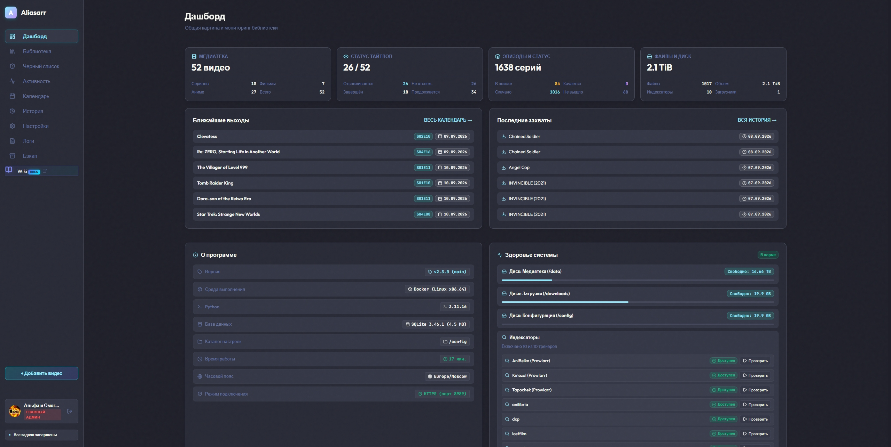
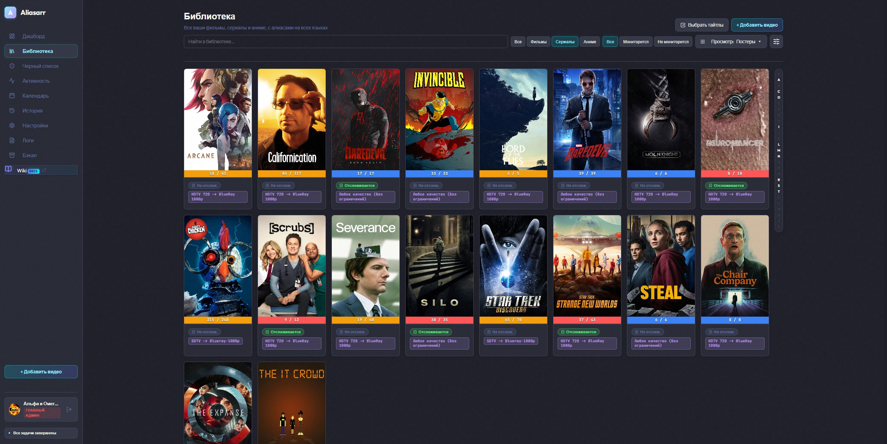
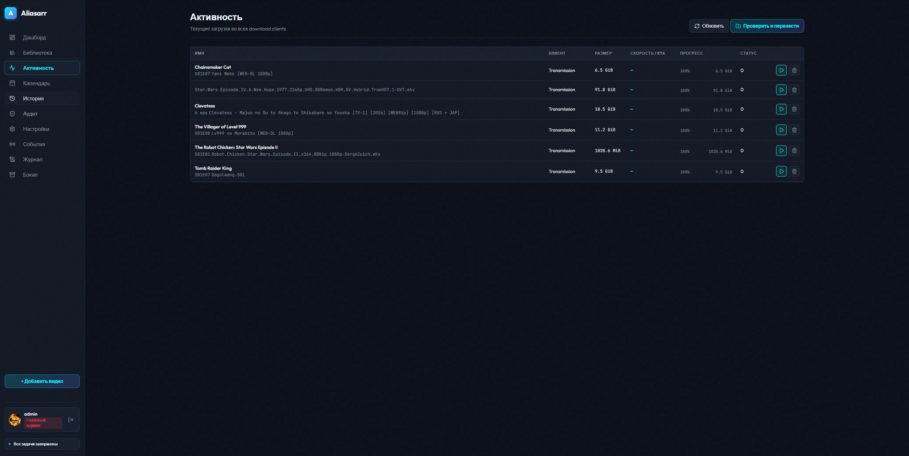
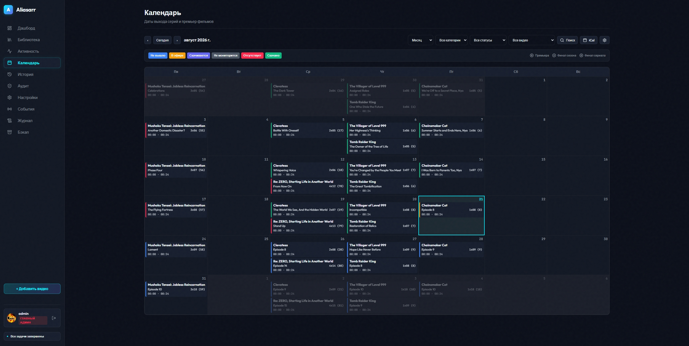
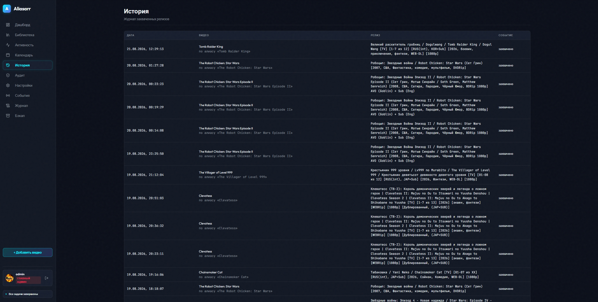
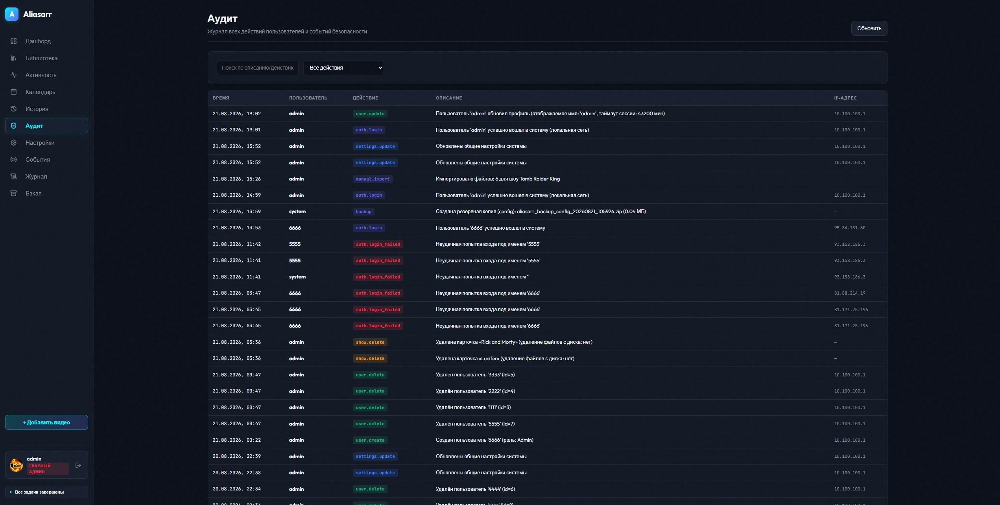
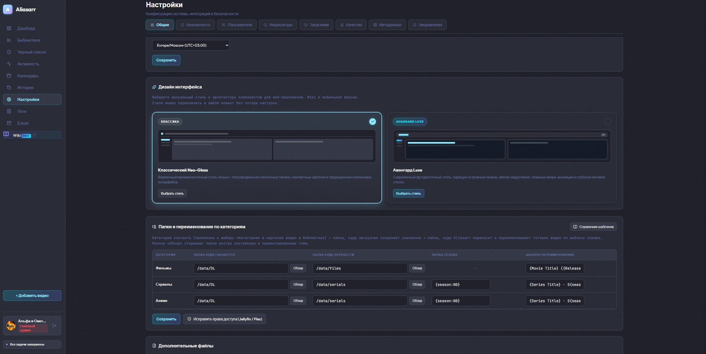
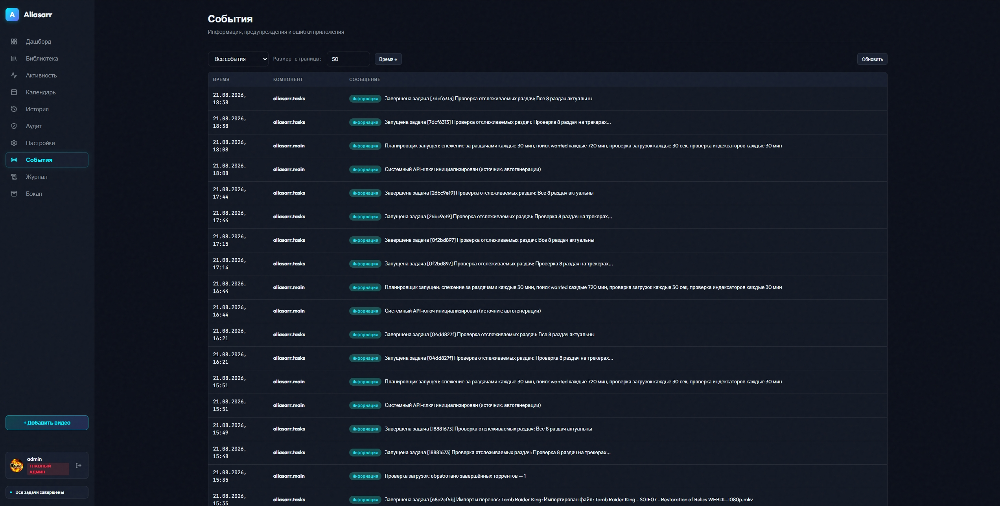
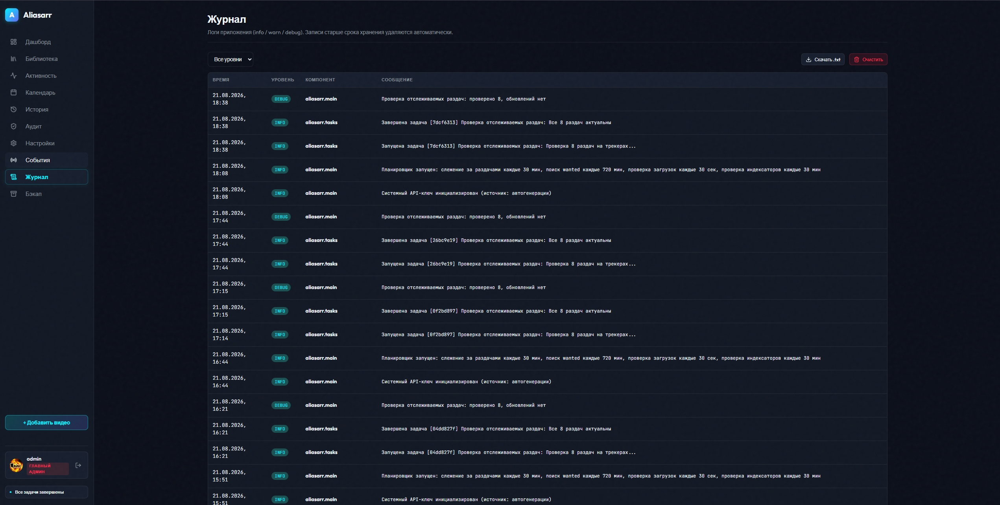
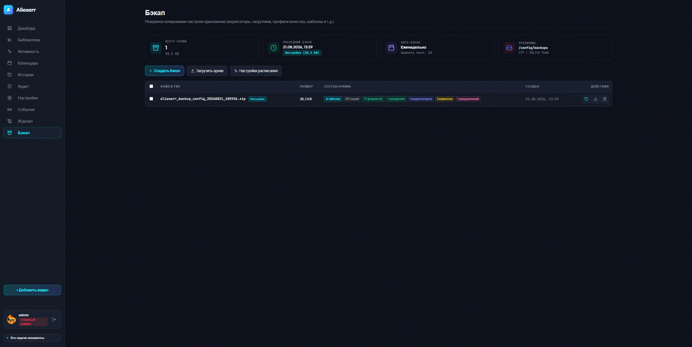

# Aliasarr

[](https://github.com/lQwestl/aliasarr/actions/workflows/ci.yml)
[](http://www.gnu.org/licenses/gpl.html)
[](https://www.python.org/)
[](https://fastapi.tiangolo.com/)
[](https://www.docker.com/)

**Aliasarr** — автономная система управления медиатекой фильмов, сериалов и аниме с поддержкой мультиязычных алиасов, интеллектуальным парсером сезонов и серий, селективной загрузкой, защитой от перезаписи, автоматическим слежением за обновляемыми раздачами, мультиканальными уведомлениями, ролевой моделью доступа (RBAC), двухфакторной аутентификацией (2FA TOTP) и интерактивным центром фоновых задач.

Проект создавался на основе идей и архитектурных концепций **Radarr** и **Sonarr** и распространяется под свободной лицензией **[GNU GPL v3](http://www.gnu.org/licenses/gpl.html)**.

---

## Оглавление

1. [Ключевые возможности](#ключевые-возможности)
   - [Мультиязычные алиасы и сопоставление релизов](#1-мультиязычные-алиасы-и-сопоставление-релизов)
   - [Источники метаданных и синхронизация](#2-источники-метаданных-и-синхронизация)
   - [Изолированный импорт и селективная загрузка](#3-изолированный-импорт-и-селективная-загрузка)
   - [Управление сидированием и раздачей](#4-управление-сидированием-и-раздачей)
   - [Индексаторы и клиенты загрузки](#5-индексаторы-и-клиенты-загрузки)
   - [Профили и форматы качества](#6-профили-и-форматы-качества)
   - [Мультиканальные уведомления](#7-мультиканальные-уведомления)
   - [Безопасность, RBAC и двухфакторная аутентификация](#8-безопасность-rbac-и-двухфакторная-аутентификация)
   - [Интерактивный интерфейс и фоновые операции](#9-интерактивный-интерфейс-и-фоновые-операции)
2. [Скриншоты интерфейса](#скриншоты-интерфейса)
3. [Сборка и запуск в Docker](#сборка-и-запуск-в-docker)
   - [Способ 1. Автоматическая сборка и запуск через Docker Compose (рекомендуется)](#способ-1-автоматическая-сборка-и-запуск-через-docker-compose-рекомендуется)
   - [Способ 2. Ручная сборка и запуск через Docker CLI](#способ-2-ручная-сборка-и-запуск-через-docker-cli)
4. [Переменные окружения и тома данных](#переменные-окружения-и-тома-данных)
5. [Архитектура проекта](#архитектура-проекта)
6. [Разработка и тестирование](#разработка-и-тестирование)
7. [Лицензия](#лицензия)

---

## Ключевые возможности

### 1. Мультиязычные алиасы и сопоставление релизов
- **Полноценный поиск по любым альтернативным названиям**: поддержка русских, английских, оригинальных японских названий (иероглифика кандзи, катакана, ромадзи) и транслитераций.
- **Автоматическое расщепление составных алиасов**: строки со слэшами (`/`) и пайпами (`|`) автоматически разбиваются на независимые поисковые запросы, отправляемые во все подключенные трекеры.
- **Интеллектуальный парсер сезонов и эпизодов**:
  - Комбинированные полные паки (`[TV+OVA]`, `TV+SP`, `1-12+1`), закрывающие одновременно основной сезон и спецвыпуски.
  - Диапазоны сезонов (`Сезоны 1-5`, `S01-S05`), финальные сезоны (`Final Season`), спецвыпуски (`OVA`, `ONA`, `Special`, `SP`).
  - Распознавание абсолютной нумерации аниме (`01..1000+`) с автосопоставлением номеров сезонов и серий.
  - Сегментация составных названий (цифры в конце заголовка больше не сбивают нумерацию серий и сезонов).
  - Определение релиз-групп, кодеков, разрешения, источников и аудиопараметров.
- **Интеллектуальная фильтрация**:
  - **Защита по годам выпуска (`show_year`)**: автоматическое отсеивание ремейков, перезапусков и одноименных адаптаций других годов.
  - **Глобальный фильтр не-видео контента**: строгий отсев ранобэ (Light Novel), манги, комиксов, артбуков, сканов и электронных книг (`.epub`, `.fb2`, `.pdf`, `.cbr`, `.cbz`, `[тома 1-11]`).
  - **Фильтрация несовместимых форматов**: отсев дорам/Live-Action при поиске аниме и отсеивание сырых многодисковых DVD/BD-образов (`10x DVD9`, `8x DVD5`, `BDMV`, `ISO`).
  - Защита от ложных совпадений спин-оффов и полнометражных фильмов при мониторинге сериалов.

### 2. Источники метаданных и синхронизация
- **Sonarr SkyHook (TVDB Proxy)** — нативная поддержка облачного каталога для сериалов и аниме.
- **Radarr SkyHook** — получение метаданных, дат премьер и постеров для фильмов.
- **The Movie Database (TMDB)** — интеграция через API v3 и v4 Read Access Token.
- **TVMaze** — каталог сериалов с поддержкой стандартного и Premium API.
- **TheTVDB v4** — поддержка официального API v4 и Subscriber PIN.
- **Автоматическая фоновая синхронизация**: обновление официальных названий серий, добавление анонсированных эпизодов и актуализация дат выхода серий и кинопремьер.

### 3. Изолированный импорт и селективная загрузка
- **Изоляция файлов конкретного релиза (Zero-Miss Isolation)**: опрос манифеста файлов раздачи (`t.files`) и перенос исключительно файлов целевой раздачи, исключая случайный захват чужих файлов из общих папок загрузок.
- **Селективная загрузка (Selective Download)**: автоматическое выставление приоритетов файлов в торрент-клиенте (скачиваются только разыскиваемые серии сезона, а не весь сезонный пак).
- **Поддержка Companion-файлов и внешнего звука**:
  - Полная поддержка всех форматов внешнего аудио (`.mka`, `.aac`, `.ac3`, `.dts`, `.eac3`, `.flac`, `.mp3`, `.m4a`, `.wav`, `.opus`) и субтитров (`.ass`, `.srt`, `.sub`, `.idx`, `.vtt`).
  - Автоматическое распознавание и включение в загрузку любых папок с озвучками и доп. материалами (`Sound [...]`, `Audio [...]`, `Озвучка [...]`, `Звук [...]`, `OST`, `Fonts`, `Subs`).
  - Четкое разделение файлов регулярных серий и спецвыпусков при импорте.
- **MediaInfo**: автоматическое чтение технических характеристик импортированных видеофайлов (разрешение, кодеки, аудиодорожки, битрейт).

### 4. Управление сидированием и раздачей
- **Индивидуальные лимиты раздачи для клиентов**:
  - *Seed Time Limit* — максимальное время раздачи в минутах (`0` — мгновенный импорт сразу после завершения загрузки).
  - *Seed Ratio Limit* — минимальный коэффициент отдачи (Ratio).
- Автоматическая безопасная пауза торрента по достижении лимитов с последующим переносом и переименованием файлов в библиотеку.

### 5. Индексаторы и клиенты загрузки
- **Поддерживаемые типы индексаторов (с приоритетами 0..1000)**:
  - **Torznab** (Prowlarr, Jackett, трекеры с нативным API).
  - **Newznab** (Usenet-индексаторы).
  - **Nyaa.si** (прямой поиск и парсинг аниме-трекера).
  - **Torrent RSS**, **IPTorrents**, **TorrentLeech** (персональные RSS-ленты).
- **Поддерживаемые загрузчики**:
  - **qBittorrent** (Web API v2).
  - **Transmission** (RPC).
  - **Deluge** (Web JSON-RPC со стримингом torrent-файлов).
  - **rTorrent / ruTorrent** (XML-RPC `/RPC2` и HTTP-RPC).
  - **Aria2** (JSON-RPC с Secret Token).
  - **Torrent Blackhole** (сохранение `.torrent` и `.magnet` в Watch-директорию).
  - **SABnzbd & NZBGet** (клиенты Usenet).

### 6. Профили и форматы качества
- **Гибкая система условий (Regex & Quality Formats)**: ранжирование по характеристикам (HDR10+, Dolby Vision, AV1, HEVC, x264, TrueHD Atmos, DTS-HD MA, FLAC, релиз-группы).
- **Пороги отсечки качества (Quality / Score Cutoff)** с автоматическим обновлением релизов при появлении более качественной раздачи (Quality Upgrade).
- Встроенный интерактивный справочник форматов и кодеков.

### 7. Мультиканальные уведомления
- **Telegram** (поддержка топиков/тредов `message_thread_id`, тихих сообщений, постеров).
- **Discord** (форматированные Rich Embeds с обложками и ссылками).
- **Gotify, Ntfy, Pushover, Slack, Webhook, SMTP Email, Apprise, Custom Script**.
- Тонкая настройка событий: захват раздачи, завершение загрузки, успешный импорт, апгрейд качества, создание бэкапа, системные ошибки.

### 8. Безопасность, RBAC и двухфакторная аутентификация
- **Многопользовательский режим**: система ролей (Администратор, Менеджер, Пользователь, Наблюдатель).
- **Двухфакторная аутентификация (2FA TOTP)**: поддержка Google Authenticator, 1Password, Aegis, Bitwarden с генерацией QR-кодов.
- **SSL / TLS**: встроенный менеджер сертификатов (автоматический выпуск и продление самоподписанных сертификатов или загрузка Custom SSL).
- **Аудит безопасности**: фиксация всех действий пользователей, изменений настроек и сессий с сохранением IP-адресов.

### 9. Интерактивный интерфейс, Релиз логи и фоновые операции
- Полностью адаптивный веб-интерфейс для ПК, планшетов и мобильных устройств с поддержкой тем оформления (Dark, Light, Dracula) и локализаций (Русский, Английский).
- **Диагностический журнал релизов (Релиз логи)**:
  - Отображение всех этапов работы движка: поиск, сопоставление, парсинг серий, оценка Decision Engine, вызовы загрузчиков и импорт.
  - Прямые кликабельные ссылки `↗` на страницы раздач на трекерах прямо из таблицы и модального окна.
  - Выгрузка полного журнала в текстовый файл (`.txt`).
- **Центр фоновых задач**: отображение хода выполнения операций в реальном времени (автопоиск, проверка загрузок, ручной импорт, опрос индексаторов, бэкапы).
- **Интерактивный календарь**: режимы «Месяц», «Неделя», «День», «Повестка дня», экспорт в формат iCalendar (`.ics`).
- **Интерактивный поиск (Interactive Search)**: детальный предпросмотр релизов трекеров, отображение очков кастомных форматов, причин отклонения и принудительный захват.
- **Глобальный и индивидуальный ручной импорт**: пакетный импорт произвольных каталогов загрузок с сопоставлением серий.
- **Резервное копирование и восстановление**: автоматическое создание и ручная выгрузка архивов базы данных и конфигурации.

---

## Скриншоты интерфейса

### Главная панель (Дашборд)
Сводная статистика медиатеки, распределение тайтлов и серий, ближайшие премьеры и статус работоспособности системы:


### Медиатека
Отображение постеров фильмов, сериалов и аниме с цветовой индикацией прогресса и статусов отслеживания:


### Мониторинг загрузок (Активность)
Очередь активных загрузок во всех подключенных клиентах, скорость, прогресс и управление сидированием:


### Календарь релизов
Интерактивное расписание выхода эпизодов и кинопремьер с фильтрацией по статусам и категориям:


### История захватов
Журнал найденных и отправленных в загрузчики раздач с отображением сработавшего поискового алиаса:


### Журнал аудита безопасности
Детальный аудит действий пользователей, входов в систему, изменений настроек и IP-адресов клиентов:


### Настройки системы и шаблоны путей
Управление интерфейсом, API-ключами, источниками метаданных и правилами автоматического переименования:


### События и системный журнал
Мониторинг фоновых служб планировщика и просмотр диагностических логов приложения:




### Резервное копирование
Управление резервными копиями базы данных, кастомных форматов и настроек с возможностью восстановления:


---

## Сборка и запуск в Docker

Каждый пользователь самостоятельно собирает Docker-образ Aliasarr под архитектуру своего сервера или устройства (x86_64, ARM64, Raspberry Pi и др.) непосредственно из исходных файлов проекта.

### Способ 1. Автоматическая сборка и запуск через Docker Compose (рекомендуется)

1. Создайте в каталоге проекта файл `docker-compose.yml`:

```yaml
version: "3.8"

services:
  aliasarr:
    build: .
    container_name: aliasarr
    restart: unless-stopped
    ports:
      - "8989:8989"
    environment:
      - DATABASE_URL=sqlite:////config/aliasarr.db
      - TZ=Europe/Moscow
      - PUID=1000
      - PGID=1000
    volumes:
      - ./config:/config
      - ./downloads:/downloads
      - ./media/movies:/media/movies
      - ./media/series:/media/series
      - ./media/anime:/media/anime
    deploy:
      resources:
        limits:
          cpus: "2.0"
          memory: 1024M
        reservations:
          cpus: "0.25"
          memory: 256M
```

2. Запустите сборку и старт контейнера одной командой:

```bash
docker compose up -d --build
```

---

### Способ 2. Ручная сборка и запуск через Docker CLI

1. Соберите локальный образ под архитектуру вашей системы:

```bash
docker build -t aliasarr:local .
```

2. Запустите собранный образ:

```bash
docker run -d \
  --name aliasarr \
  --restart unless-stopped \
  -p 8989:8989 \
  -e DATABASE_URL=sqlite:////config/aliasarr.db \
  -e TZ=Europe/Moscow \
  -e PUID=1000 \
  -e PGID=1000 \
  -v $(pwd)/config:/config \
  -v $(pwd)/downloads:/downloads \
  -v $(pwd)/media/movies:/media/movies \
  -v $(pwd)/media/series:/media/series \
  -v $(pwd)/media/anime:/media/anime \
  aliasarr:local
```

- **Веб-интерфейс**: `http://<IP-сервера>:8989`
- **Интерактивная документация REST API (Swagger UI)**: `http://<IP-сервера>:8989/docs`

---

## Переменные окружения и тома данных

### Переменные окружения

| Переменная | Описание | Значение по умолчанию |
| :--- | :--- | :--- |
| `DATABASE_URL` | Строка подключения к базе данных (SQLite или PostgreSQL) | `sqlite:////config/aliasarr.db` |
| `TZ` | Системный часовой пояс контейнера | `Europe/Moscow` |
| `PUID` | UID пользователя внутри контейнера для прав доступа к файлам | `1000` |
| `PGID` | GID группы внутри контейнера для прав доступа к файлам | `1000` |
| `ALIASARR_PORT` | Порт веб-сервера | `8989` |
| `ALIASARR_ADMIN_PASSWORD` | Первоначальный пароль администратора | генерируется случайно при первом старте |
| `ALIASARR_API_KEY` | Первоначальный системный API-ключ | генерируется случайно при первом старте |

### Основные директории и тома (Volumes)

- `/config` — база данных SQLite, системные настройки, сертификаты SSL, бэкапы.
- `/downloads` — рабочая папка загрузок торрент-клиента.
- `/media/movies` — корневая папка библиотеки фильмов.
- `/media/series` — корневая папка библиотеки сериалов.
- `/media/anime` — корневая папка библиотеки аниме.

---

## Архитектура проекта

```
app/
├── main.py                  # Инициализация FastAPI, lifespan, планировщик фоновых задач
├── database.py              # Подключение к БД (SQLAlchemy 2.x, SQLite / PostgreSQL)
├── schemas.py               # Pydantic-схемы валидации и сериализации API
├── auth.py                  # Middleware аутентификации, сессии, API-ключи
├── models/
│   └── db.py                # Определение таблиц БД (Shows, Episodes, Aliases, Indexers, Users...)
├── api/
│   ├── shows.py             # Маршруты управления тайтлами, сериями, алиасами и ручным импортом
│   ├── indexers.py          # Поиск по трекерам, проверка доступности, интерактивный захват
│   ├── download_clients.py  # Управление и тестирование торрент- и usenet-загрузчиков
│   ├── metadata_routes.py   # Эндпоинты поиска метаданных (TMDB, TVMaze, SkyHook, TheTVDB)
│   ├── settings_routes.py   # Настройки приложения, путей, шаблонов, кастомных форматов
│   ├── system_routes.py     # Системный журнал, события, бэкапы, проводник файловой системы
│   ├── auth_routes.py       # Аутентификация, профили пользователей, управление 2FA TOTP
│   └── operations.py        # Центр фоновых задач (/tasks), профили качества, уведомления
└── services/
    ├── auto_search.py       # Фоновый автопоиск разыскиваемых релизов и апгрейдов качества
    ├── downloads_monitor.py # Мониторинг очередей загрузок и управление лимитами раздачи
    ├── postprocess.py       # Перемещение серий, фильмов, companion-файлов и MediaInfo
    ├── matcher.py           # Сопоставление названий релизов с алиасами и фильтрацией
    ├── parser.py            # Парсинг сезонов, номеров серий, кодеков и типов контента
    ├── tracker.py           # Отслеживание обновляемых тем и докачка новых серий
    ├── quality.py           # Оценка качества видео, HDR и кастомных форматов
    ├── task_manager.py      # Менеджер активных и недавних фоновых задач
    ├── notifications.py     # Диспетчер отправки уведомлений по всем каналам
    └── user_service.py      # Ролевая модель (RBAC), токены и верификация TOTP
web/
├── index.html               # Одностраничное веб-приложение (SPA)
├── quality-guide.html       # Интерактивный справочник по форматам и профилям качества
├── css/style.css            # Таблицы стилей интерфейса и адаптивная верстка
└── js/app.js                # Клиентская логика, реактивный рендеринг, переводы i18n
```

---

## Разработка и тестирование

Запуск полного набора автоматических тестов:

```bash
# Запуск всех модульных тестов проекта
python3 -m unittest discover tests

# Запуск тестов универсального парсера релизов
python3 tests/test_parser.py

# Проверка покрытия словарей локализации (RU / EN)
python3 -m unittest tests/test_i18n_coverage.py

# Синтаксическая валидация Python-модулей
python3 -m py_compile $(find app -name "*.py")
```

---

## Лицензия

Проект **Aliasarr** создавался на основе архитектурных принципов и функциональных концепций проектов **Radarr** и **Sonarr**.

Исходный код Aliasarr распространяется на условиях лицензии **GNU General Public License v3.0 (GPLv3)**:

- Полный текст лицензии доступен на официальном сайте: [http://www.gnu.org/licenses/gpl.html](http://www.gnu.org/licenses/gpl.html).


